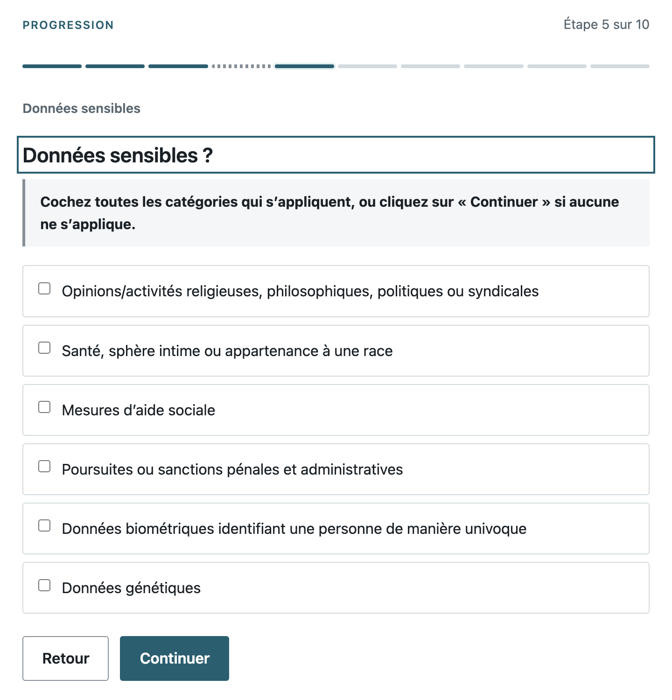

# AI_GO : quel outil IA pour vos données ?

En deux minutes, sans compte, le questionnaire vous dit quelle famille d'outils IA vous pouvez utiliser avec un jeu de
données : LLMs commerciaux, LLMs institutionnels (sous contrat avec votre institution) ou LLMs en local uniquement.
Il a été écrit à l'Université de Lausanne pour le droit suisse (LPD, LPrD-VD, LRH, secret de fonction).

**Essayez-le : <https://ia.unil.ch/AI_GO>** (français et anglais, ordinateur et mobile). Le billet qui le présente :
[AI_GO : deux minutes pour savoir quel outil d'IA vous pouvez utiliser avec vos données](https://wp.unil.ch/iaunil/ai_go-deux-minutes-pour-savoir-quel-outil-dia-vous-pouvez-utiliser-avec-vos-donnees/).

Ce dépôt contient trois choses. **Le questionnaire de l'UNIL, lisible sans ouvrir de code** : les 11 questions et les
7 résultats ci-dessous ; les options, les textes d'aide, le schéma et les 20 chemins en phrases dans [docs/ARBRE.md](docs/ARBRE.md).
Il est publié pour être lu et cité, pas pour être copié. **Comment il a été fait**, en quelques lignes. **Le moteur** qui le fait
tourner : un seul fichier HTML (`ai-go.html`), libre, avec son validateur `check.html` ; guide technique, en anglais : [docs/INTEGRATE.md](docs/INTEGRATE.md).

## Les 11 questions

| | Question posée | Réponse et suite | À réexaminer en premier chez vous |
|---|---|---|---|
| q1 | Les données concernent-elles des individus ? | oui → q2 ; non → q10 | |
| q2 | Les individus sont-ils identifiables ? (3 cases : directement, indirectement, par corrélation) | au moins une case → q3 ; aucune → q10 | |
| q3 | Le risque d'identification des individus est-il faible ? | oui → q4 ; non → q5 | un seuil de risque : un jugement, pas un fait |
| q4 | Le risque de réidentification par recoupement est-il faible ? (5 cases : peu de croisement, agrégation, tranches d'âge larges, généralisation, population large) | **au moins une case → q10** ; aucune → q5 | la seule question à cases où cocher fait sortir de la branche « données personnelles » ; le fichier le déclare (`polarity: "inverse"`) |
| q5 | Données sensibles ? (6 cases) | au moins une case → q6 ; aucune → q7 | les six catégories de la LPD et de la LPrD-VD |
| q6 | Les données sont-elles liées à la santé ou à la génétique humaine ? | oui → R3 ; non → R4 | la définition de l'art. 3 LRH, citée telle quelle |
| q7 | Données délicates ? (4 cases : aspects privés non intimes, vulnérabilité, revenu ou fortune, relations d'affaires ou bancaires) | au moins une case → q8 ; aucune → q9 | « données délicates » : pas de terme anglais établi, le fichier dit « high-risk personal data » |
| q8 | Analyse d'impact avec le DPO (le risque est-il faible selon l'analyse faite avec le DPO ?) | oui → R6 ; non → R5 | une analyse d'impact menée avec le DPO |
| q9 | Données secondaires ? | oui → q9a ; non → R6 | |
| q9a | Anonymisation des données (anonymes ou efficacement anonymisées ?) | oui → R7 ; non → R6 | |
| q10 | Les données ont-elles une restriction sur leur partage ? | oui → R2 ; non → R1 | secret de fonction, secret professionnel, NDA, MOU |

## Les 7 résultats

| | Titre affiché | Outils autorisés |
|---|---|---|
| R1 | Pas de données personnelles · Pas de restriction | Utilisation libre : commerciaux, institutionnels, local |
| R2 | Pas de données personnelles · Données avec restrictions | LLMs institutionnels ou LLMs en local |
| R3 | Données personnelles · Sensibles · LRH · Restriction | LLMs en local UNIQUEMENT ; contacter la DCSR |
| R4 | Données personnelles · Sensibles · Restriction | LLMs en local UNIQUEMENT |
| R5 | Données personnelles · Délicates · Restriction | LLMs en local UNIQUEMENT, tant qu'une analyse d'impact n'a pas réduit le risque |
| R6 | Données personnelles · Restriction de partage | LLMs institutionnels ou LLMs en local |
| R7 | Données anonymisées · Sans restriction de partage | Utilisation libre, si l'anonymisation est irréversible |

Les trois familles d'outils sont celles que l'UNIL a, ou n'a pas, sous contrat : chez vous, la liste sera différente, et c'est la première chose à réécrire.

## Comment il a été fait

Les questions, les résultats et les décisions qu'ils portent ont été écrits par la **Cellule stratégique IA de l'UNIL**
avec trois étudiantes en droit de la **Professeure Aurelia Tamò-Larrieux** : **Selma Lamas Valverde**, **Emma Lo Cicero**
et **Clara Montangero**. Le questionnaire a été relu par la Cellule stratégique IA et le DPO de l'UNIL ; la date de
relecture est inscrite dans `reference/aigo-unil.js` (champ `review.date`) et `ai-go.html` l'affiche sous chaque résultat.

En septembre 2026, pour le faire tourner sur ce moteur sans changer une décision, ses 20 chemins ont été relevés deux fois,
indépendamment (lecture de la page en ligne, énumération sur le contenu extrait), comparés, puis gelés dans `reference/aigo-unil.paths.js` :
toute modification du routage fait rougir ce fichier. Ce qui n'a pas été fait : le texte et le moteur n'ont été séparés qu'à cette
migration, pas au départ ; l'accessibilité est vérifiée par le harnais (clavier, focus, annonces, reflow à 320 px) et dans un
navigateur, mais aucun test avec une personne qui utilise un lecteur d'écran n'a eu lieu.

## Faire le vôtre

Le travail est dans les questions, pas dans le code. L'étape 1 est la vôtre et prend des semaines ; les étapes 2 à 4 prennent une heure avec un·e webmaster.

1. **Écrivez** vos questions et vos résultats dans un document, en reprenant la forme de [docs/ARBRE.md](docs/ARBRE.md)
   (une question, ses options, sa suite), avec votre service juridique et la liste de vos outils sous contrat. Si vous
   partez du nôtre, écrivez-nous d'abord et déclarez `derivedFrom` dans votre fichier : chaque résultat dira alors que
   l'UNIL n'a pas relu votre version. Hors unil.ch, le moteur refuse un texte qui cite AI_GO, l'UNIL ou la DCSR ailleurs.
2. **Téléchargez** `ai-go.html` (icône de téléchargement à côté du bouton **Raw** ; le fichier doit finir en `.html`) et
   ouvrez-le par double-clic : tel quel, il montre un exemple de trois questions. Recopiez vos textes dans la moitié haute
   du fichier, entre `AI_GO-CONTENT-BEGIN` et `AI_GO-CONTENT-END`, ainsi que le titre et le chapeau de la page, juste en
   dessous ; les règles d'écriture sont en tête du bloc (guillemets doubles, pas de chevron). Le moteur, plus bas, ne se touche pas.
3. **Vérifiez** : ouvrez `check.html`, déposez-y votre fichier et indiquez le domaine où vous publierez : verdict pour ce
   domaine, liste de tous les chemins, questions inatteignables. Faites relire cette liste par la personne qui a validé vos questions.
4. **Publiez** : déclarez ce domaine, préproduction comprise, dans `publisher.domains`, sinon la page en ligne ne montre
   qu'une boîte de refus. Puis fichier seul, bloc HTML d'un CMS ou iframe : [docs/INTEGRATE.md](docs/INTEGRATE.md).

## Le dépôt

`ai-go.html` (gabarit vide en haut, moteur 3.0.1 en bas ; s'ouvre par double-clic), `check.html` (validateur), `test/run.mjs`
(harnais : `node test/run.mjs`), `reference/` (le questionnaire de l'UNIL, FR/EN, et ses 20 chemins gelés, empreinte 59b6dc65), `docs/`.

**Ce qui tourne sur ia.unil.ch/AI_GO n'est pas encore ce fichier.** La page en ligne sert une implémentation antérieure
du même questionnaire ; les 20 chemins de ce dépôt ont été relevés sur cette page, et le harnais vérifie que `ai-go.html`
les reproduit.

## Nous écrire

Adapter le questionnaire à votre droit cantonal ou au RGPD, comparer vos chemins aux nôtres, signaler un défaut : ouvrez une
[issue](https://github.com/unil-ia/AI_GO/issues), en français ou en anglais, ou écrivez à la Cellule stratégique IA : <iaunil@unil.ch>.

## Crédits et licences

Questionnaire : Cellule stratégique IA de l'Université de Lausanne, avec Selma Lamas Valverde, Emma Lo Cicero et Clara
Montangero, étudiantes en droit de la Professeure Aurelia Tamò-Larrieux. Le code du moteur a été écrit avec l'assistance
de Claude (Anthropic) ; le raisonnement qu'il porte est le leur. Citer : `CITATION.cff`.

Moteur, validateur, harnais : BSD 3-Clause (`LICENSE`). Gabarit vide et format du contenu : CC0. Texte du questionnaire
de l'UNIL (`reference/`, `docs/ARBRE.md`) : tous droits réservés, publié pour référence. Le lire et le citer avec la
source : oui. Pour tout autre usage (republier, traduire, adapter) : écrivez-nous.

## In English

AI_GO tells you in two minutes which family of AI tools you may use with a given dataset: commercial, institutional under
contract, or local LLMs only. Try it: <https://ia.unil.ch/AI_GO> (FR/EN). This repository holds UNIL's questionnaire
(11 questions, 7 results, 20 paths, Swiss law; all rights reserved: read it, cite it, do not copy it) and the engine that
runs it: one HTML file (engine under BSD 3-Clause, empty template CC0) with a validator page. Guide: [docs/INTEGRATE.md](docs/INTEGRATE.md).
