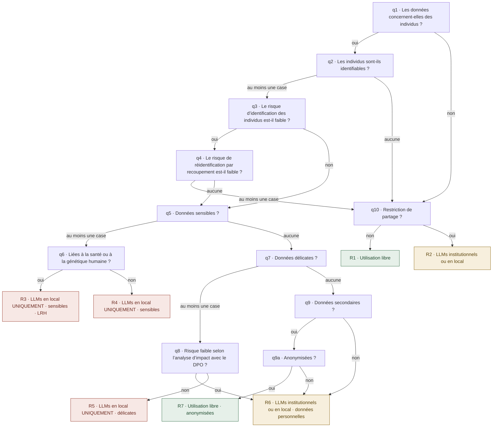

# Le questionnaire AI_GO de l’UNIL, transcrit pour être lu

Transcription en français de `reference/aigo-unil.js` (contenu « 2026-09-01 », empreinte cbdb4863aed9f778). Les titres, les
textes d’aide, les libellés des cases, des réponses et des résultats ci-dessous reprennent ce fichier **mot pour mot**,
et le harnais de test le vérifie chaîne par chaîne. En cas d’écart, le fichier JavaScript a raison : c’est lui que le
moteur exécute. Ce texte est publié pour référence, tous droits réservés : lisez-le, citez-le avec la source ; pour le
republier, le traduire ou l’adapter, écrivez-nous (README, « Nous écrire »). Il encode le droit suisse et des décisions
prises par l’UNIL pour sa communauté ; ailleurs, il est à réexaminer question par question.

## Les sigles

AVS : assurance-vieillesse et survivants (le numéro d’assuré suisse). DCSR : Division calcul et soutien à la recherche
de l’UNIL. DPO : délégué·e à la protection des données. LPD : loi fédérale sur la protection des données. LPrD-VD : son
équivalent vaudois. LRH : loi relative à la recherche sur l’être humain. LLM : grand modèle de langue.

## Le schéma

Le schéma ci-dessous est entièrement retranscrit en texte dans les deux sections suivantes : rien n’y est dit qui
ne soit écrit en toutes lettres plus bas.

Vert : les trois familles d’outils sont permises. Ambre : LLMs institutionnels ou en local. Rouge : LLMs en local
uniquement. Les dix étapes du fil d’Ariane sont, dans l’ordre : Données personnelles, Identifiabilité, Risque
d’identification, Risque de réidentification, Données sensibles, Lien LRH, Données délicates, Analyse d’impact DPO,
Données secondaires, Restriction de partage (q9 et q9a partagent l’étape 9).

## Les questions et leurs options

**q1. Les données concernent-elles des individus ?**

Indiquez si vos données portent directement ou indirectement sur des personnes physiques.

Réponses :
- Oui : Mes données concernent des individus → q2
- Non : Mes données ne concernent pas des individus → q10

**q2. Les individus sont-ils identifiables ?**

**Cochez tous les critères qui s’appliquent à vos données, ou cliquez sur « Continuer » si aucun critère ne s’applique.**

Cases à cocher :
- Données directement identifiantes (nom, prénom, email, téléphone, AVS, visage, IP, etc.)
- Données indirectement identifiantes (date de naissance précise, lieu d’habitation précis, etc.)
- Corrélation possible avec la personne (informations rares ou contexte permettant l’identification)

Routage : au moins une case → q3 ; aucune → q10.

**q3. Le risque d’identification des individus est-il faible ?**

**Exemples de données faiblement identifiantes :**
- Sexe (H/F)
- Date de naissance (année seulement)
- Profession généralisée
- Pathologie commune

Réponses :
- Oui : Uniquement des données faiblement identifiantes → q4
- Non : Contient des données plus identifiantes → q5

**q4. Le risque de réidentification par recoupement est-il faible ?**

**Cochez les éléments qui s’appliquent, ou cliquez sur « Continuer » si aucun ne s’applique.**

Cases à cocher :
- Peu de croisement possible entre les données
- Résultats statistiques agrégés
- Âge en tranches larges (ex : 20–30 ans)
- Généralisation des données
- Population large et diversifiée

Routage : au moins une case → q10 ; aucune → q5.

Attention au sens : ici, cocher fait sortir de la branche des données personnelles ; le fichier le déclare par `polarity: "inverse"`.

**q5. Données sensibles ?**

**Cochez toutes les catégories qui s’appliquent, ou cliquez sur « Continuer » si aucune ne s’applique.**

Cases à cocher :
- Opinions/activités religieuses, philosophiques, politiques ou syndicales
- Santé, sphère intime ou appartenance à une race
- Mesures d’aide sociale
- Poursuites ou sanctions pénales et administratives
- Données biométriques identifiant une personne de manière univoque
- Données génétiques

Routage : au moins une case → q6 ; aucune → q7.

**q6. Les données sont-elles liées à la santé ou à la génétique humaine ?**

**Définition légale (art. 3 LRH) :**

« Les informations concernant une personne déterminée ou déterminable qui ont un lien avec son état de santé ou sa maladie, données génétiques comprises »

Réponses :
- Oui : Données liées à la santé ou à la génétique humaine → R3
- Non : Autres données sensibles → R4

**q7. Données délicates ?**

Catégorie intermédiaire sans être sensible, mais présentant un risque élevé pour la personnalité.

**Cochez toutes les catégories qui s’appliquent, ou cliquez sur « Continuer » si aucune ne s’applique.**

Cases à cocher :
- Aspects privés mais non intimes (au contraire de la santé, la religion, les opinions)
- Révèlent une vulnérabilité potentielle
- Données sur le revenu ou la fortune
- Relations d’affaires (selon les cas) ou bancaires (selon les cas)

Routage : au moins une case → q8 ; aucune → q9.

**q8. Analyse d’impact avec le DPO**

Le risque pour les personnes est-il faible (réduit) selon l’analyse d’impact effectuée avec le DPO ?

**Note :** L’analyse d’impact est une obligation légale lorsque le risque est élevé pour les individus.

Réponses :
- Oui : Risque faible confirmé par le DPO → R6
- Non : Pas d’analyse ou risque important tant qu’une analyse n’a pas démontré le contraire → R5

**q9. Données secondaires ?**

Le projet implique-t-il l’utilisation de données secondaires ?

**Définition :** Données déjà collectées pour une finalité autre que le projet actuel ; données que l’équipe n’a pas elle-même produites.

Réponses :
- Oui : Utilisation de données secondaires → q9a
- Non : Données primaires uniquement → R6

**q9a. Anonymisation des données**

Les données sont-elles anonymes ou efficacement anonymisées ?

**Note :** La pseudonymisation ne suffit pas : les données restent traçables.

Réponses :
- Oui : Anonymisation complète et irréversible → R7
- Non : Données encore identifiables → R6

**q10. Les données ont-elles une restriction sur leur partage ?**

**Note :** p. ex. secret de fonction, secret professionnel, NDA, MOU

Réponses :
- Oui : Les données ont au moins une restriction applicable → R2
- Non : Le partage des données est libre → R1

## Les résultats

**R1. Pas de données personnelles · Pas de restriction**

Vos données ne présentent pas de restrictions particulières.

Solution recommandée : Utilisation libre.

Outils proposés :
- LLMs commerciaux
- LLMs institutionnels (contractualisés par l’UNIL)
- LLMs en local (sur infrastructure UNIL ou personnelle)

**R2. Pas de données personnelles · Données avec restrictions**

Vos données ont des restrictions sur leur partage.

Solution recommandée : LLMs institutionnels ou LLMs en local.

Outils proposés :
- LLMs institutionnels (contractualisés par l’UNIL)
- LLMs en local (sur infrastructure UNIL ou personnelle)

**Important :** L’utilisation de LLMs commerciaux cloud n’est pas légale sauf pour les solutions proposées par l’institution.

**R3. Données personnelles · Sensibles · LRH · Restriction**

Vos données sont sensibles et soumises à la LRH.

Solution recommandée : LLMs en local UNIQUEMENT.

Outils proposés :
- LLMs en local UNIQUEMENT (sur infrastructure UNIL ou personnelle)

Interdits :
- AUCUN LLM cloud institutionnel
- AUCUN LLM commercial

**Protection maximale requise :** Ces données nécessitent le plus haut niveau de protection. Contactez la DCSR.

**R4. Données personnelles · Sensibles · Restriction**

Vos données sont sensibles et nécessitent une protection renforcée.

Solution recommandée : LLMs en local UNIQUEMENT.

Outils proposés :
- LLMs en local UNIQUEMENT (sur infrastructure UNIL ou personnelle)

Interdits :
- AUCUN LLM externe ou cloud
- AUCUN LLM commercial

**Protection renforcée requise :** Données sensibles nécessitant des mesures de sécurité strictes.

**R5. Données personnelles · Délicates · Restriction**

Vos données sont délicates avec un risque non réduit.

Solution recommandée : LLMs en local UNIQUEMENT.

Outils proposés :
- LLMs en local UNIQUEMENT (sur infrastructure UNIL ou personnelle)

**Note :** Tant qu’une analyse d’impact n’a pas réduit le risque, ces données nécessitent une protection locale.

**R6. Données personnelles · Restriction de partage**

Vos données sont personnelles et soumises au secret de fonction.

Solution recommandée : LLMs institutionnels ou LLMs en local.

Outils proposés :
- LLMs institutionnels (contractualisés par l’UNIL)
- LLMs en local (sur infrastructure UNIL ou personnelle)

**Important :** Les LLMs commerciaux externes ne sont pas autorisés pour ces données personnelles.

**R7. Données anonymisées · Sans restriction de partage**

Vos données sont correctement anonymisées.

Solution recommandée : Utilisation libre.

Outils proposés :
- LLMs commerciaux
- LLMs institutionnels (contractualisés par l’UNIL)
- LLMs en local (sur infrastructure UNIL ou personnelle)

**Note :** Vérifiez que l’anonymisation est irréversible avant d’utiliser des LLMs externes.

Sous chaque résultat, `ai-go.html` affiche quatre choses. **Qui répond du contenu**, en clair : l’éditeur, les
relecteurs et la date de relecture, tels que `reference/aigo-unil.js` les déclare. **L’avertissement** : « Outil
d’aide à la décision, il ne garantit pas une sécurité et une conformité légale à 100 %, l’utilisateur·rice demeure
responsable de l’évaluation finale et des mesures mises en œuvre. » Puis **les deux moitiés du reçu**, une par ligne :
« contenu cbdb4863aed9f778 · moteur 3.0.19 », qui couvre le départ, les questions, les résultats et les liens ;
et « signature 321ed52bf89fec97 », qui couvre tout le reste de ce que le lecteur voit, l’éditeur, la relecture,
l’avertissement, le droit cité, le nom des étapes et les libellés d’interface. Les deux se relèvent ensemble ;
aucun des deux n’est une signature au sens juridique du terme. La page en ligne, qui exécute une implémentation
antérieure, n’affiche aucune de ces deux lignes.

## Cinq remarques sur la logique

1. Ne rien cocher à q4 (« aucun facteur de faible réidentification ») mène à q5, exactement comme répondre « non » à
   q3 : les deux branches se rejoignent, et tout ce qui suit est identique.
2. À q6, « oui » et « non » donnent la même consigne, « LLMs en local UNIQUEMENT » ; la différence est dans le titre
   (LRH), la liste des interdictions et l’alerte « Contactez la DCSR ».
3. q8 est le seul endroit où une réponse rouvre les LLMs institutionnels : « risque faible confirmé par le DPO » mène à
   R6 ; sans analyse, ou avec un risque non réduit, R5 impose le local.
4. R7 s’intitule « Sans restriction de partage » alors que la branche qui y mène (q9 puis q9a) ne passe jamais par q10,
   la question sur les restrictions de partage. L’absence de restriction y est donc déduite de l’anonymisation, pas
   demandée. C’est une décision de l’UNIL, gelée comme le reste ; chez vous, c’est un point à réexaminer.
5. Le cas symétrique vaut pour R6, « Restriction de partage » : aucun de ses six chemins ne passe par q10 non plus. La
   restriction y est présumée du fait que les données sont personnelles. Même remarque : décision de l’UNIL, à
   réexaminer ailleurs.

## Les 20 chemins

Ce sont les 20 parcours possibles, tels que `reference/aigo-unil.paths.js` les fige, dans le même ordre. Pour une
question à cases, seul compte « au moins une case » ou « aucune ». Lecture : réponse à chaque question, puis résultat.
La forme en fin de ligne, entre accents graves, est celle que le moteur énumère et que le harnais compare à l’oracle ;
la phrase qui la précède est une aide de lecture, écrite à la main, et c’est elle qu’il faut relire de près.

1. Pas d’individus ; pas de restriction de partage ⇒ R1. `q1=no → q10=no`
2. Pas d’individus ; restriction de partage ⇒ R2. `q1=no → q10=yes`
3. Individus ; identifiables ; risque d’identification non faible ; catégorie sensible ; pas de lien santé ou génétique ⇒ R4. `q1=yes → q2=any → q3=no → q5=any → q6=no`
4. Individus ; identifiables ; risque non faible ; catégorie sensible ; lien santé ou génétique ⇒ R3. `q1=yes → q2=any → q3=no → q5=any → q6=yes`
5. Individus ; identifiables ; risque non faible ; rien de sensible ; catégorie délicate ; risque non réduit par le DPO ⇒ R5. `q1=yes → q2=any → q3=no → q5=none → q7=any → q8=no`
6. Individus ; identifiables ; risque non faible ; rien de sensible ; catégorie délicate ; risque faible confirmé par le DPO ⇒ R6. `q1=yes → q2=any → q3=no → q5=none → q7=any → q8=yes`
7. Individus ; identifiables ; risque non faible ; rien de sensible ; rien de délicat ; données primaires ⇒ R6. `q1=yes → q2=any → q3=no → q5=none → q7=none → q9=no`
8. Individus ; identifiables ; risque non faible ; rien de sensible ; rien de délicat ; données secondaires ; non anonymisées ⇒ R6. `q1=yes → q2=any → q3=no → q5=none → q7=none → q9=yes → q9a=no`
9. Individus ; identifiables ; risque non faible ; rien de sensible ; rien de délicat ; données secondaires ; anonymisées ⇒ R7. `q1=yes → q2=any → q3=no → q5=none → q7=none → q9=yes → q9a=yes`
10. Individus ; identifiables ; risque faible ; au moins un facteur de faible réidentification ; pas de restriction ⇒ R1. `q1=yes → q2=any → q3=yes → q4=any → q10=no`
11. Individus ; identifiables ; risque faible ; au moins un facteur de faible réidentification ; restriction ⇒ R2. `q1=yes → q2=any → q3=yes → q4=any → q10=yes`
12. Individus ; identifiables ; risque faible ; aucun facteur coché ; catégorie sensible ; pas de lien santé ou génétique ⇒ R4. `q1=yes → q2=any → q3=yes → q4=none → q5=any → q6=no`
13. Individus ; identifiables ; risque faible ; aucun facteur coché ; catégorie sensible ; lien santé ou génétique ⇒ R3. `q1=yes → q2=any → q3=yes → q4=none → q5=any → q6=yes`
14. Individus ; identifiables ; risque faible ; aucun facteur coché ; rien de sensible ; délicate ; risque non réduit ⇒ R5. `q1=yes → q2=any → q3=yes → q4=none → q5=none → q7=any → q8=no`
15. Individus ; identifiables ; risque faible ; aucun facteur coché ; rien de sensible ; délicate ; risque faible confirmé ⇒ R6. `q1=yes → q2=any → q3=yes → q4=none → q5=none → q7=any → q8=yes`
16. Individus ; identifiables ; risque faible ; aucun facteur coché ; rien de sensible ; rien de délicat ; données primaires ⇒ R6. `q1=yes → q2=any → q3=yes → q4=none → q5=none → q7=none → q9=no`
17. Individus ; identifiables ; risque faible ; aucun facteur coché ; rien de sensible ; rien de délicat ; données secondaires ; non anonymisées ⇒ R6. `q1=yes → q2=any → q3=yes → q4=none → q5=none → q7=none → q9=yes → q9a=no`
18. Individus ; identifiables ; risque faible ; aucun facteur coché ; rien de sensible ; rien de délicat ; données secondaires ; anonymisées ⇒ R7. `q1=yes → q2=any → q3=yes → q4=none → q5=none → q7=none → q9=yes → q9a=yes`
19. Individus ; aucun critère d’identifiabilité coché ; pas de restriction ⇒ R1. `q1=yes → q2=none → q10=no`
20. Individus ; aucun critère d’identifiabilité coché ; restriction ⇒ R2. `q1=yes → q2=none → q10=yes`

Répartition : R1 ×3, R2 ×3, R3 ×2, R4 ×2, R5 ×2, R6 ×6, R7 ×2.

Ce document ne dit pas *pourquoi* chaque réponse mène là où elle mène : ce raisonnement n’a pas été rédigé pour
publication. Pour en discuter, écrivez-nous (README, « Nous écrire »).
