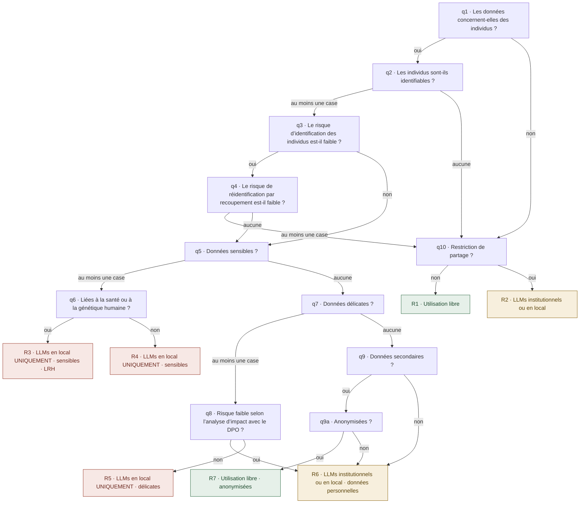

# Le questionnaire AI_GO de l’UNIL, transcrit pour être lu

Transcription en français de `reference/aigo-unil.js` (contenu « 2026-09-01 », empreinte 59b6dc65), faite le
6 septembre 2026. En cas d’écart, le fichier JavaScript a raison : c’est lui que le moteur exécute et que le harnais
vérifie, et le harnais vérifie aussi que chaque titre de question et de résultat ci-dessous reprend ce fichier mot pour
mot. Ce texte est publié pour référence, tous droits réservés : lisez-le, citez-le avec la source ; pour le republier,
le traduire ou l’adapter, écrivez-nous (README, « Nous écrire »). Il encode le droit suisse et des décisions prises par
l’UNIL pour sa communauté ; ailleurs, il est à réexaminer question par question.

## Le schéma

Vert : les trois familles d’outils sont permises. Ambre : LLMs institutionnels ou en local. Rouge : LLMs en local
uniquement. Les dix étapes du fil d’Ariane sont, dans l’ordre : Données personnelles, Identifiabilité, Risque
d’identification, Risque de réidentification, Données sensibles, Lien LRH, Données délicates, Analyse d’impact DPO,
Données secondaires, Restriction de partage (q9 et q9a partagent l’étape 9).

## Les questions et leurs options

**q1. Les données concernent-elles des individus ?** Indiquez si vos données portent directement ou indirectement
sur des personnes physiques. Oui (mes données concernent des individus) → q2. Non → q10.

**q2. Les individus sont-ils identifiables ?** Cochez tous les critères qui s’appliquent, ou continuez si aucun ne
s’applique : données directement identifiantes (nom, prénom, email, téléphone, AVS, visage, IP, etc.) ; données
indirectement identifiantes (date de naissance précise, lieu d’habitation précis, etc.) ; corrélation possible avec la
personne (informations rares ou contexte permettant l’identification). Au moins une case → q3. Aucune → q10.

**q3. Le risque d’identification des individus est-il faible ?** Exemples de données faiblement identifiantes :
sexe (H/F), date de naissance (année seulement), profession généralisée, pathologie commune. Oui (uniquement des
données faiblement identifiantes) → q4. Non (contient des données plus identifiantes) → q5.

**q4. Le risque de réidentification par recoupement est-il faible ?** Cochez les éléments qui s’appliquent, ou
continuez si aucun ne s’applique : peu de croisement possible entre les données ; résultats statistiques agrégés ; âge
en tranches larges (ex. : 20 à 30 ans) ; généralisation des données ; population large et diversifiée. Au moins une
case → q10. Aucune → q5. Attention au sens : ici, cocher rassure et fait sortir de la branche « données
personnelles » ; le fichier le déclare (`polarity: "inverse"`).

**q5. Données sensibles ?** Cochez toutes les catégories qui s’appliquent, ou continuez si aucune ne s’applique :
opinions ou activités religieuses, philosophiques, politiques ou syndicales ; santé, sphère intime ou appartenance à
une race ; mesures d’aide sociale ; poursuites ou sanctions pénales et administratives ; données biométriques
identifiant une personne de manière univoque ; données génétiques. Au moins une case → q6. Aucune → q7.

**q6. Les données sont-elles liées à la santé ou à la génétique humaine ?** Définition légale (art. 3 LRH) :
« Les informations concernant une personne déterminée ou déterminable qui ont un lien avec son état de santé ou sa
maladie, données génétiques comprises ». Oui → R3. Non (autres données sensibles) → R4.

**q7. Données délicates ?** Catégorie intermédiaire sans être sensible, mais présentant un risque élevé pour la
personnalité. Cochez toutes les catégories qui s’appliquent, ou continuez si aucune ne s’applique : aspects privés
mais non intimes (au contraire de la santé, la religion, les opinions) ; révèlent une vulnérabilité potentielle ;
données sur le revenu ou la fortune ; relations d’affaires (selon les cas) ou bancaires (selon les cas). Au moins une
case → q8. Aucune → q9.

**q8. Analyse d’impact avec le DPO.** Le risque pour les personnes est-il faible (réduit) selon l’analyse d’impact
effectuée avec le DPO ? Note : l’analyse d’impact est une obligation légale lorsque le risque est élevé pour les
individus. Oui (risque faible confirmé par le DPO) → R6. Non (pas d’analyse, ou risque important tant qu’une analyse
n’a pas démontré le contraire) → R5.

**q9. Données secondaires ?** Le projet implique-t-il l’utilisation de données secondaires ? Définition : données
déjà collectées pour une finalité autre que le projet actuel ; données que l’équipe n’a pas elle-même produites.
Oui (utilisation de données secondaires) → q9a. Non (données primaires uniquement) → R6.

**q9a. Anonymisation des données.** Les données sont-elles anonymes ou efficacement anonymisées ? Note : la
pseudonymisation ne suffit pas, les données restent traçables. Oui (anonymisation complète et irréversible) → R7.
Non (données encore identifiables) → R6.

**q10. Les données ont-elles une restriction sur leur partage ?** Note : p. ex. secret de fonction, secret
professionnel, NDA, MOU. Oui (au moins une restriction applicable) → R2. Non (le partage des données est libre) → R1.

## Les résultats

**R1. Pas de données personnelles · Pas de restriction.** Vos données ne présentent pas de restrictions
particulières. Utilisation libre : LLMs commerciaux, LLMs institutionnels, LLMs en local.

**R2. Pas de données personnelles · Données avec restrictions.** Vos données ont des restrictions sur leur partage.
Solution recommandée (conforme au droit) : LLMs institutionnels ou LLMs en local. Important : l’utilisation de LLMs
commerciaux cloud n’est pas légale sauf pour les solutions proposées par l’institution.

**R3. Données personnelles · Sensibles · LRH · Restriction.** Vos données sont sensibles et soumises à la LRH. LLMs
en local UNIQUEMENT ; aucun LLM cloud institutionnel, aucun LLM commercial. Protection maximale requise : ces données
nécessitent le plus haut niveau de protection. Contactez la DCSR.

**R4. Données personnelles · Sensibles · Restriction.** Vos données sont sensibles et nécessitent une protection
renforcée. LLMs en local UNIQUEMENT ; aucun LLM externe ou cloud, aucun LLM commercial. Protection renforcée requise :
données sensibles nécessitant des mesures de sécurité strictes.

**R5. Données personnelles · Délicates · Restriction.** Vos données sont délicates avec un risque non réduit. LLMs
en local UNIQUEMENT. Note : tant qu’une analyse d’impact n’a pas réduit le risque, ces données nécessitent une
protection locale.

**R6. Données personnelles · Restriction de partage.** Vos données sont personnelles et soumises au secret de
fonction. LLMs institutionnels ou LLMs en local. Important : les LLMs commerciaux externes ne sont pas autorisés pour
ces données personnelles.

**R7. Données anonymisées · Sans restriction de partage.** Vos données sont correctement anonymisées. Utilisation
libre. Note : vérifiez que l’anonymisation est irréversible avant d’utiliser des LLMs externes.

Sous chaque résultat, `ai-go.html` affiche la signature du fichier (éditeur, relecteurs et date de relecture, tels
que `reference/aigo-unil.js` les déclare), l’avertissement (« Outil d’aide à la décision, il ne garantit pas une
sécurité et une conformité légale à 100 %, l’utilisateur·rice demeure responsable de l’évaluation finale et des mesures
mises en œuvre. ») et la ligne « contenu 59b6dc65 · moteur 3.0.1 ». La page en ligne, qui exécute une implémentation
antérieure, n’affiche pas cette signature.

## Trois remarques sur la logique

1. Ne rien cocher à q4 (« aucun facteur de faible réidentification ») mène à q5, exactement comme répondre « non » à
   q3 : les deux branches se rejoignent, et tout ce qui suit est identique.
2. À q6, « oui » et « non » donnent la même consigne, « LLMs en local UNIQUEMENT » ; la différence est dans le titre
   (LRH), la liste des interdictions et l’alerte « Contactez la DCSR ».
3. q8 est le seul endroit où une réponse rouvre les LLMs institutionnels : « risque faible confirmé par le DPO » mène à
   R6 ; sans analyse, ou avec un risque non réduit, R5 impose le local.

## Les 20 chemins

Ce sont les 20 parcours possibles, tels que `reference/aigo-unil.paths.js` les fige, dans le même ordre. Pour une
question à cases, seul compte « au moins une case » ou « aucune ». Lecture : réponse à chaque question, puis résultat.

1. Pas d’individus ; pas de restriction de partage ⇒ R1.
2. Pas d’individus ; restriction de partage ⇒ R2.
3. Individus ; identifiables ; risque d’identification non faible ; catégorie sensible ; pas de lien santé ou génétique ⇒ R4.
4. Individus ; identifiables ; risque non faible ; catégorie sensible ; lien santé ou génétique ⇒ R3.
5. Individus ; identifiables ; risque non faible ; rien de sensible ; catégorie délicate ; risque non réduit par le DPO ⇒ R5.
6. Individus ; identifiables ; risque non faible ; rien de sensible ; catégorie délicate ; risque faible confirmé par le DPO ⇒ R6.
7. Individus ; identifiables ; risque non faible ; rien de sensible ni de délicat ; données primaires ⇒ R6.
8. Individus ; identifiables ; risque non faible ; rien de sensible ni de délicat ; données secondaires non anonymisées ⇒ R6.
9. Individus ; identifiables ; risque non faible ; rien de sensible ni de délicat ; données secondaires anonymisées ⇒ R7.
10. Individus ; identifiables ; risque faible ; au moins un facteur de faible réidentification ; pas de restriction ⇒ R1.
11. Individus ; identifiables ; risque faible ; au moins un facteur de faible réidentification ; restriction ⇒ R2.
12. Individus ; identifiables ; risque faible ; aucun facteur coché ; catégorie sensible ; pas de lien santé ou génétique ⇒ R4.
13. Individus ; identifiables ; risque faible ; aucun facteur coché ; catégorie sensible ; lien santé ou génétique ⇒ R3.
14. Individus ; identifiables ; risque faible ; aucun facteur coché ; rien de sensible ; délicate ; risque non réduit ⇒ R5.
15. Individus ; identifiables ; risque faible ; aucun facteur coché ; rien de sensible ; délicate ; risque faible confirmé ⇒ R6.
16. Individus ; identifiables ; risque faible ; aucun facteur coché ; rien de sensible ni de délicat ; données primaires ⇒ R6.
17. Individus ; identifiables ; risque faible ; aucun facteur coché ; rien de sensible ni de délicat ; secondaires non anonymisées ⇒ R6.
18. Individus ; identifiables ; risque faible ; aucun facteur coché ; rien de sensible ni de délicat ; secondaires anonymisées ⇒ R7.
19. Individus ; aucun critère d’identifiabilité coché ; pas de restriction ⇒ R1.
20. Individus ; aucun critère d’identifiabilité coché ; restriction ⇒ R2.

Répartition : R1 ×3, R2 ×3, R3 ×2, R4 ×2, R5 ×2, R6 ×6, R7 ×2.

Ce document ne dit pas *pourquoi* chaque réponse mène là où elle mène : ce raisonnement n’a pas été rédigé pour
publication. Pour en discuter, écrivez-nous (README, « Nous écrire »).
