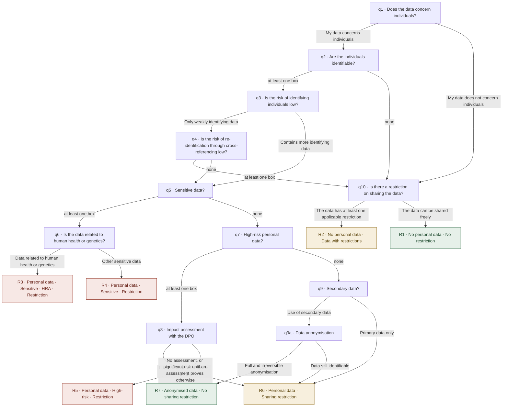

# The AI_GO questionnaire of UNIL, transcribed to be read

English transcription of the frozen tree (content "2026-09-01", fingerprint cbdb4863aed9f778). The titles, help texts
and labels of the boxes, answers and results below are that file's own English, **word for word**: this page is
rendered from it by `tools/anglais.mjs`. The headings, the routing connectives, the diagram's edge labels and these
opening paragraphs are the tool's own words; everything else is the file's. The test harness re-renders the page and
compares its own output with the file on disk, byte for byte, so no hand edit survives here. Where page and file
disagree, the JavaScript file is right: it is what the engine runs. Published for reference, all rights reserved: read
it, cite it with its source; to republish, translate or adapt it, write to us at <iaunil@unil.ch>. It encodes Swiss
law and decisions taken by UNIL for its own community; elsewhere it is to be re-examined question by question.

Three sections of the French page `ARBRE.md` are not here, and not by oversight: the glossary of Swiss legal acronyms,
the five remarks on the logic and the reading aids beside the 20 paths are commentary written at UNIL in French.
Translating them would mean writing new text about Swiss law, which is the authors' call, not this tool's. There is no
language button in the page: the engine mounts in the language of the container's `data-lang`, and `ai-go.html` here
sets it to `fr`. An institution that wants the English interface sets `data-lang="en"`; the questions and results
below are that same content, read rather than answered.

The page published at <https://ia.unil.ch/AI_GO> runs an EARLIER implementation of this same questionnaire, word for
word. It is not the engine named at the foot of this page, and it prints neither of the two receipt lines, so do not
compare what it shows with the fingerprint above.

Written for CH-VD against LPD, LPrD-VD, LRH, secret de fonction (named here as the file names them, in French where
the file has no English form). Three abbreviations run through the text and this page does not expand them: DCSR, DPO
and HRA. They are the institution's own, the French page expands the French ones under its heading "Les sigles", and
spelling out Swiss statutes in English would be a translation this repository does not make. HRA is the abbreviation
the file's own English uses where its French says LRH. Ask the publisher named under any result if one of them decides
your case.

**Disclaimer:** A decision-support tool, it does not guarantee 100% security and legal compliance; the user remains responsible for the final assessment and for the measures implemented.

## The diagram

Everything the diagram shows is written out in full in the two sections that follow: it says nothing that is not
spelled out below.

Green: all three families of tools are allowed. Amber: institutional or local LLMs. Red: local LLMs only. The ten
steps of the breadcrumb are, in order: Personal data, Identifiability, Identification risk, Re-identification risk,
Sensitive data, HRA link, High-risk data, DPO impact assessment, Secondary data, Sharing restriction (q9 and q9a share
step 9).

## The questions and their options

**q1. Does the data concern individuals?**

Indicate whether your data relates directly or indirectly to natural persons.

Answers:
- Yes: My data concerns individuals → q2
- No: My data does not concern individuals → q10

**q2. Are the individuals identifiable?**

**Check all criteria that apply to your data, or click “Continue” if none apply.**

Tick boxes:
- Directly identifying data (name, first name, email, phone, social security number, face, IP, etc.)
- Indirectly identifying data (precise date of birth, precise place of residence, etc.)
- Possible correlation with the person (rare information or context enabling identification)

Routing: at least one box → q3; none → q10.

**q3. Is the risk of identifying individuals low?**

**Examples of weakly identifying data:**
- Sex (M/F)
- Date of birth (year only)
- Generalised occupation
- Common medical condition

Answers:
- Yes: Only weakly identifying data → q4
- No: Contains more identifying data → q5

**q4. Is the risk of re-identification through cross-referencing low?**

**Check the items that apply, or click “Continue” if none apply.**

Tick boxes:
- Little cross-referencing possible between the data
- Aggregated statistical results
- Age in broad ranges (e.g. 20–30 years)
- Generalisation of the data
- Large and diverse population

Routing: at least one box → q10; none → q5.

Mind the direction: here, ticking a box leaves the personal-data branch; the file declares it with `polarity: "inverse"`.

**q5. Sensitive data?**

**Check all categories that apply, or click “Continue” if none apply.**

Tick boxes:
- Religious, philosophical, political or trade-union opinions/activities
- Health, intimate sphere or racial origin
- Social assistance measures
- Criminal or administrative proceedings or sanctions
- Biometric data uniquely identifying a person
- Genetic data

Routing: at least one box → q6; none → q7.

**q6. Is the data related to human health or genetics?**

**Legal definition (art. 3 HRA):**

“Information concerning an identified or identifiable person which relates to their state of health or illness, including genetic data”

Answers:
- Yes: Data related to human health or genetics → R3
- No: Other sensitive data → R4

**q7. High-risk personal data?**

Intermediate category: not sensitive, but posing a high risk to personal rights.

**Check all categories that apply, or click “Continue” if none apply.**

Tick boxes:
- Private but not intimate aspects (unlike health, religion, opinions)
- Reveal a potential vulnerability
- Data on income or wealth
- Business relationships (case-by-case) or banking relationships (case-by-case)

Routing: at least one box → q8; none → q9.

**q8. Impact assessment with the DPO**

Is the risk to individuals low (reduced) according to the impact assessment carried out with the DPO?

**Note:** An impact assessment is a legal obligation when the risk to individuals is high.

Answers:
- Yes: Low risk confirmed by the DPO → R6
- No: No assessment, or significant risk until an assessment proves otherwise → R5

**q9. Secondary data?**

Does the project involve the use of secondary data?

**Definition:** Data already collected for a purpose other than the current project; data that the team did not produce itself.

Answers:
- Yes: Use of secondary data → q9a
- No: Primary data only → R6

**q9a. Data anonymisation**

Is the data anonymous or effectively anonymised?

**Note:** Pseudonymisation is not enough: the data remains traceable.

Answers:
- Yes: Full and irreversible anonymisation → R7
- No: Data still identifiable → R6

**q10. Is there a restriction on sharing the data?**

**Note:** e.g. official secrecy, professional secrecy, NDA, MOU

Answers:
- Yes: The data has at least one applicable restriction → R2
- No: The data can be shared freely → R1

## The results

**R1. No personal data · No restriction**

Your data has no particular restrictions.

Recommended solution: Unrestricted use.

Suggested tools:
- [Commercial LLMs](https://padlet.com/AI_research/ai-tools-for-research-administration-and-developers-8kemyoqn7h33bs7q)
- [Institutional LLMs (contracted by UNIL)](https://wp.unil.ch/iaunil/microsoft-copilot-un-modele-de-langage-ia-securise-a-disposition-a-lunil/)
- [Local LLMs (on UNIL or personal infrastructure)](https://wp.unil.ch/iaunil/modele-ia-local-pour-les-donnees-privees-sensibles-et-liees-au-secret-de-fonction/)

**R2. No personal data · Data with restrictions**

Your data has sharing restrictions.

Recommended solution: Institutional LLMs or local LLMs.

Suggested tools:
- [Institutional LLMs (contracted by UNIL)](https://wp.unil.ch/iaunil/microsoft-copilot-un-modele-de-langage-ia-securise-a-disposition-a-lunil/)
- [Local LLMs (on UNIL or personal infrastructure)](https://wp.unil.ch/iaunil/modele-ia-local-pour-les-donnees-privees-sensibles-et-liees-au-secret-de-fonction/)

**Important:** Using cloud-based commercial LLMs is not lawful, except for the solutions provided by the institution.

**R3. Personal data · Sensitive · HRA · Restriction**

Your data is sensitive and subject to the HRA.

Recommended solution: Local LLMs ONLY.

Suggested tools:
- [Local LLMs ONLY (on UNIL or personal infrastructure)](https://wp.unil.ch/iaunil/modele-ia-local-pour-les-donnees-privees-sensibles-et-liees-au-secret-de-fonction/)

Not allowed:
- NO institutional cloud LLMs
- NO commercial LLMs

**Maximum protection required:** This data requires the highest level of protection. Contact the DCSR.

**R4. Personal data · Sensitive · Restriction**

Your data is sensitive and requires enhanced protection.

Recommended solution: Local LLMs ONLY.

Suggested tools:
- [Local LLMs ONLY (on UNIL or personal infrastructure)](https://wp.unil.ch/iaunil/modele-ia-local-pour-les-donnees-privees-sensibles-et-liees-au-secret-de-fonction/)

Not allowed:
- NO external or cloud LLMs
- NO commercial LLMs

**Enhanced protection required:** Sensitive data requiring strict security measures.

**R5. Personal data · High-risk · Restriction**

Your data is high-risk and the risk has not been mitigated.

Recommended solution: Local LLMs ONLY.

Suggested tools:
- [Local LLMs ONLY (on UNIL or personal infrastructure)](https://wp.unil.ch/iaunil/modele-ia-local-pour-les-donnees-privees-sensibles-et-liees-au-secret-de-fonction/)

**Note:** Until an impact assessment has reduced the risk, this data requires local protection.

**R6. Personal data · Sharing restriction**

Your data is personal and subject to official secrecy.

Recommended solution: Institutional LLMs or local LLMs.

Suggested tools:
- [Institutional LLMs (contracted by UNIL)](https://wp.unil.ch/iaunil/microsoft-copilot-un-modele-de-langage-ia-securise-a-disposition-a-lunil/)
- [Local LLMs (on UNIL or personal infrastructure)](https://wp.unil.ch/iaunil/modele-ia-local-pour-les-donnees-privees-sensibles-et-liees-au-secret-de-fonction/)

**Important:** External commercial LLMs are not permitted for this personal data.

**R7. Anonymised data · No sharing restriction**

Your data is correctly anonymised.

Recommended solution: Unrestricted use.

Suggested tools:
- [Commercial LLMs](https://padlet.com/AI_research/ai-tools-for-research-administration-and-developers-8kemyoqn7h33bs7q)
- [Institutional LLMs (contracted by UNIL)](https://wp.unil.ch/iaunil/microsoft-copilot-un-modele-de-langage-ia-securise-a-disposition-a-lunil/)
- [Local LLMs (on UNIL or personal infrastructure)](https://wp.unil.ch/iaunil/modele-ia-local-pour-les-donnees-privees-sensibles-et-liees-au-secret-de-fonction/)

**Note:** Verify that the anonymisation is irreversible before using external LLMs.

## The 20 paths

The 20 possible routes, exactly as `reference/aigo-unil.paths.js` freezes them and in the same order. For a tick-box
question only "at least one box" or "none" counts. The French page writes a sentence beside each of these; here the
machine form stands alone, and the result names are the identifiers the file uses.

1. `q1=no → q10=no ⇒ open_data_no_personal` R1
2. `q1=no → q10=yes ⇒ no_personal_with_secret` R2
3. `q1=yes → q2=any → q3=no → q5=any → q6=no ⇒ sensitive_no_lrh` R4
4. `q1=yes → q2=any → q3=no → q5=any → q6=yes ⇒ sensitive_lrh` R3
5. `q1=yes → q2=any → q3=no → q5=none → q7=any → q8=no ⇒ delicate_low_risk` R5
6. `q1=yes → q2=any → q3=no → q5=none → q7=any → q8=yes ⇒ personal_with_secret` R6
7. `q1=yes → q2=any → q3=no → q5=none → q7=none → q9=no ⇒ personal_with_secret` R6
8. `q1=yes → q2=any → q3=no → q5=none → q7=none → q9=yes → q9a=no ⇒ personal_with_secret` R6
9. `q1=yes → q2=any → q3=no → q5=none → q7=none → q9=yes → q9a=yes ⇒ anonymized_with_secret` R7
10. `q1=yes → q2=any → q3=yes → q4=any → q10=no ⇒ open_data_no_personal` R1
11. `q1=yes → q2=any → q3=yes → q4=any → q10=yes ⇒ no_personal_with_secret` R2
12. `q1=yes → q2=any → q3=yes → q4=none → q5=any → q6=no ⇒ sensitive_no_lrh` R4
13. `q1=yes → q2=any → q3=yes → q4=none → q5=any → q6=yes ⇒ sensitive_lrh` R3
14. `q1=yes → q2=any → q3=yes → q4=none → q5=none → q7=any → q8=no ⇒ delicate_low_risk` R5
15. `q1=yes → q2=any → q3=yes → q4=none → q5=none → q7=any → q8=yes ⇒ personal_with_secret` R6
16. `q1=yes → q2=any → q3=yes → q4=none → q5=none → q7=none → q9=no ⇒ personal_with_secret` R6
17. `q1=yes → q2=any → q3=yes → q4=none → q5=none → q7=none → q9=yes → q9a=no ⇒ personal_with_secret` R6
18. `q1=yes → q2=any → q3=yes → q4=none → q5=none → q7=none → q9=yes → q9a=yes ⇒ anonymized_with_secret` R7
19. `q1=yes → q2=none → q10=no ⇒ open_data_no_personal` R1
20. `q1=yes → q2=none → q10=yes ⇒ no_personal_with_secret` R2

---

Engine 3.1.11. Rendered by `tools/anglais.mjs` from the frozen tree; do not edit this page by hand.
